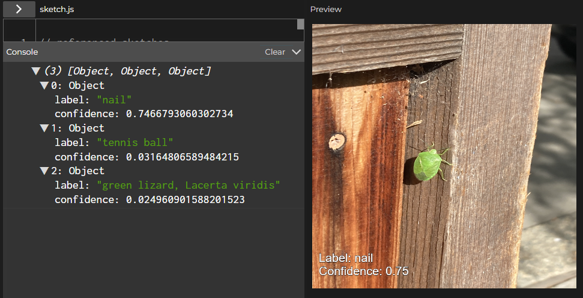

# Weekly Journals

## Week 1

Taking a look at the data set links provided, it was interesting to see the wide variety of objects these models are trained to identify. I found myself wondering however if there was enough variety of each type of object, animal, etc. What if the lighting or angle was different, or maybe the object had a different color or design? Some of the images also did not seem to be completely obvious in their relation to ID, which made me wonder about potential biases some may have about what classifies as a certain thing, and how this could affect the model. 

After experimenting with the examples for a bit, it was interesting to observe a general level of accuracy the model has. However, there were obvious hiccups and mistakes. Sometimes the correct identification was not the most confident classification, while other instances it would fail to identify something completely. There was also multiple instances of the model identifying various aspects of the image or giving close answers, but not really getting a perfect matching classification to what the subject in the image actually was. Generally, it seemed that the less complex the angle, lighting, and background was, the more likely the correct answer with high confidence would be given. 

While playing the emoji scavenger hunt, I had similar issues that I experienced with the code examples, where some objects simply could not be identified. One example was a picture of my trash can, which is a standard white plastic bin with a plastic bag lining the inside. Although I tried different angles and lighting, it would not classify it as a trash can. Overall, the materials were fun to experiment with, and although imperfect, seem to have potential for more basic and light hearted applications such as games like the scavenger hunt.  

