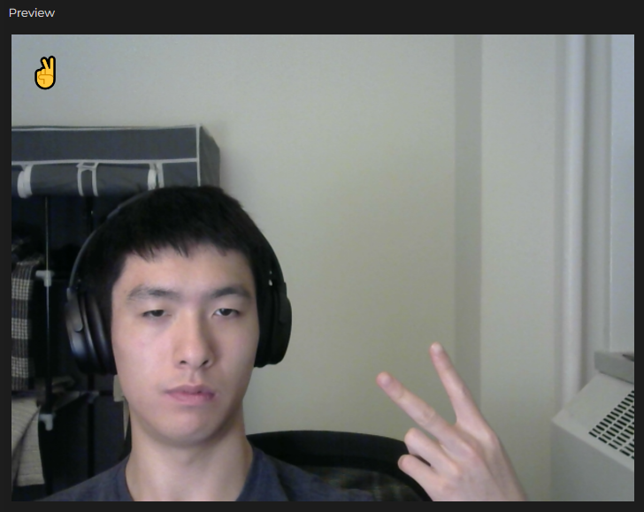
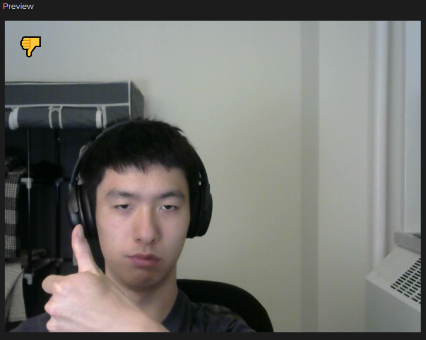
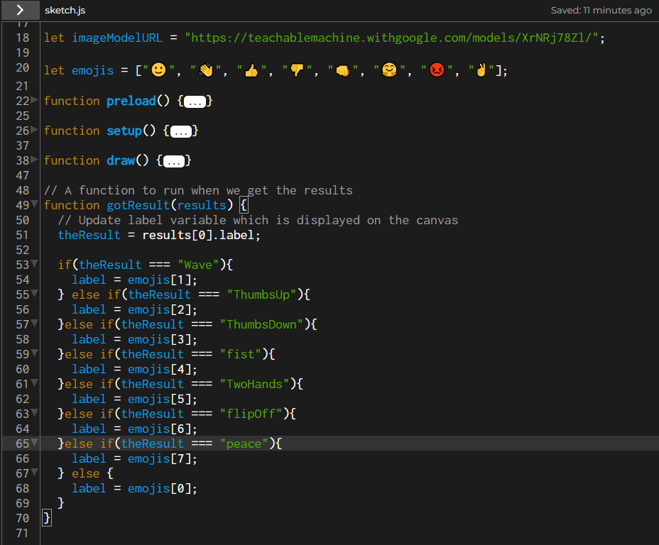

# Weekly Journals

## Week 2

As humans, we always put labels on certain events, objects, people, etc. because that is what we have evolved to do. It is a basic survival instinct that has allowed us to survive, from basic labels of "dangerous" to "not dangerous". While these instincts helped us in the past, I do wonder what the boundaries are for an application such as machine learning. Last week I discussed this in my post, pondering about how some of the labels in the dataset did not feel so accurate, and wondering about potential biases could make there way into what should be otherwise impartial algorithms. In the end, the developer or trainer does hold that power, as they dictate the machine's behavior. The only questions that I have left to pose then, are how great are these contributions and alterations really?

For this week's assignment, I decided to focus more on the training process of the model. I decided to try and train the model to give emoji reactions based on the user's actions, often reflecting what the user is doing. I trained various gestures and poses, such as a waving hand, thumbs up and down, fist, etc. and varied the position, distance, and angle for each image set. The training process was a lot of trial and error, but I found that generally more success could be found by either simplify the case parameters or trying to cover as many possibilities in angle and positioning as possible. Despite multiple re-trains of the model, however, it still proved to be quite buggy. Some noticable ones were the model getting confused on the number of fingers or their positioning. For example, a thumbs up and peace sign might appear quite different to us, as one has a single finger with a fist while the other is two fingers, however the machine would often confuse these two. The best solution I could come up with was more variety of angles and doing the gestures with both hands, but the results were mixed at best.

Example of the model correctly identifying and reacting to my gesture.

An example of when the model does not qutie get it. Other common mistakes were thumbs for peace signs and vice versa, as well as peace signs for hand waving. 

My code was kept relatively simple as I focused more on trying to effectively train the model. It is just an array with the desired reactions linked to results received from the model, converted through a series of if statements.

Overall, I found the learning model to be really fun to experiment with, although I felt a bit disastisfied with its accuracy. A machine that can accurately identify fingers and various poses or permutations of them would be a game changer from both a practical and creative stand point in my opinion.

[The Sketch](https://editor.p5js.org/rqu/sketches/0ThldbMpL)
