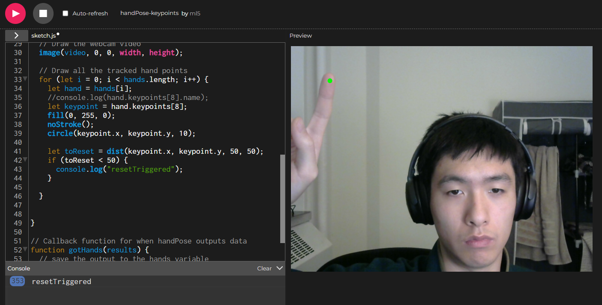
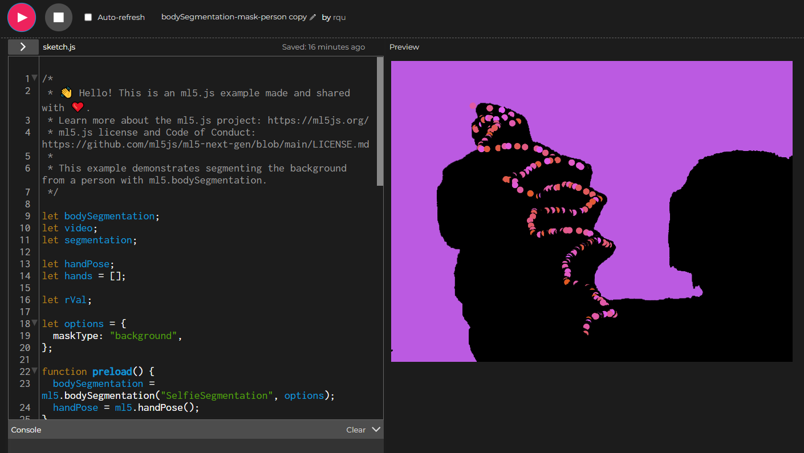

# Weekly Journals

## Week 3

The readings gave background to the origins and uses of the body pose models we saw in class. While it was interesting to see these experiments and have insights into how it was developed, I found myself wondering the most about the publication date of these articles, which dates back to 2019. I could not help but wonder, with how quickly technology develops, how much progress have we made since then? Reading about the origins of the ml5 model addressed concerns I have previously discussed in the previous weeks, most notably how the machine is only as unbiased as its creator. I felt the idea of being completely transparent in documentation, open source, and encouraging a diverse audience to be probably the best solution possible, even though it may not be perfect. 

This week, I decided to experiment with both body and hand pose. I did not really have an idea with what I wanted to create at first, so I started by just messing around with silhouettes with body pose, and trying to get them to paint the canvas. This gave me the idea of trying to create a simple painter using various body poses, but I realized that the canvas would get messy quickly especially when the user was close to the camera. I decided to mitigate this issue by adding a reset canvas button, but instead of being a traditional clickable button, I decided to use hand pose, where the canvas would reset if it detected the index finger in the upper left corner. While referencing the hand pose example from the ml5 documentation, I also decided to keep the dot that tracked the index finger, as it added a touch of color that I found to be interesting. 

Initial testing of the hand pose example, isolating the index finger tip. The console log also shows that my reset position (upper left corner) is working. 

A demo of what the final looked like. The body leaves a black silhouette that paints the background while the finger tip paints with a dot that changes color. I was hoping to figure out how to change the color of the silhouette, but could not figure out how. 

Experimenting with the body and hand pose tools was a fun experience. Although I did not do anything too complex, it felt pretty cool and satisfying to use and just mess around with. My assignment this week was probably more a proof of concept or learning experience for something I can consider in the future. 

[The Sketch](https://editor.p5js.org/rqu/sketches/T3-IqUhw6)
