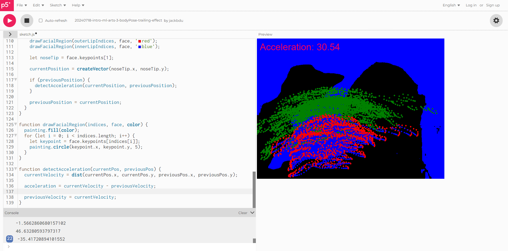

# Weekly Journals

## Week 6
For this two week long project, I decided to go back to an idea I previously worked on a few weeks back, which was the body painter. I really enjoyed working on that project, and there were a number of features that I wished to include but was not able to get to. However, I did not want to simply build my code off of the pre-existing project, but to reimagine and reimplement the ideas I worked on. A one sentence summary of the project could be:

"A painting project that illustrates and captures the movement of a subject."

Something that I was unsatisfied with while working on the previous body painter was how it did not capture movement very well. The canvas quickly became blurred by a silhouette, and drawing with a singular finger was tedious. I also wanted more visual feedback that communicated movement, but did not require a specific action by the user. 

To achieve a constant sense of movement, I decided to play with the background colors, while being controlled by the user’s movement. I decided to use acceleration of the user’s face, and used the face mask to track movement. Using the coordinates from the tip of the nose, I could keep track of head movement, and used the acceleration to calculate the background color. This meant that any movement of the head would give a visual response, but faster movements would provide more vibrant colors (due to the higher values). 

Testing of the painter, complete with all the debugging text + console logs

Only having a single finger to paint on a canvas felt like a let down last project, so I decided use the face mask coordinates as a starter for painting. Using the pinch painter example from class, I made the painting process controllable by only painting when a pinch is detected. Using the face as a brush leads to a very messy canvas as the user moves around, but although it may not have been the most aesthetically pleasing, I felt that it successfully captured movement.

A challenge I encountered was the face brush, and trying to make the strokes smooth. In the pinch example, the brush creates smooth lines, which is done by constantly calculating the previous node and connecting it with a stroke to the new node. When I copied this variable set up for the face, however, it connected all the dots in the face. This makes sense, as all the dots were sharing the same two variables, but to circumvent it, I realized that I would probably have to create a separate class to create objects, and use "this". Due to time restraints, I chose to scrap this feature rather than give it a try. Other plans I had for possible future developments would have been a lagging silhouette of a different color, further emphasizing the user's movement, as well as another hand pose command that would clear the board. Overall, although I didn't get to everything I had hoped to, I stil feel like my project succeeds at capturing and illustrating movement. 

[Link to code ](https://editor.p5js.org/rqu/sketches/aT8VqK0Qz)
