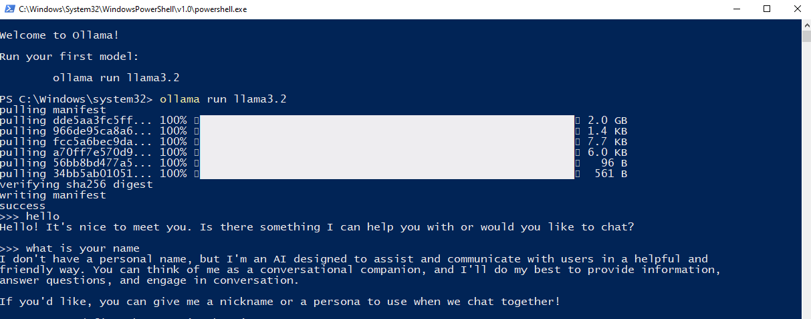
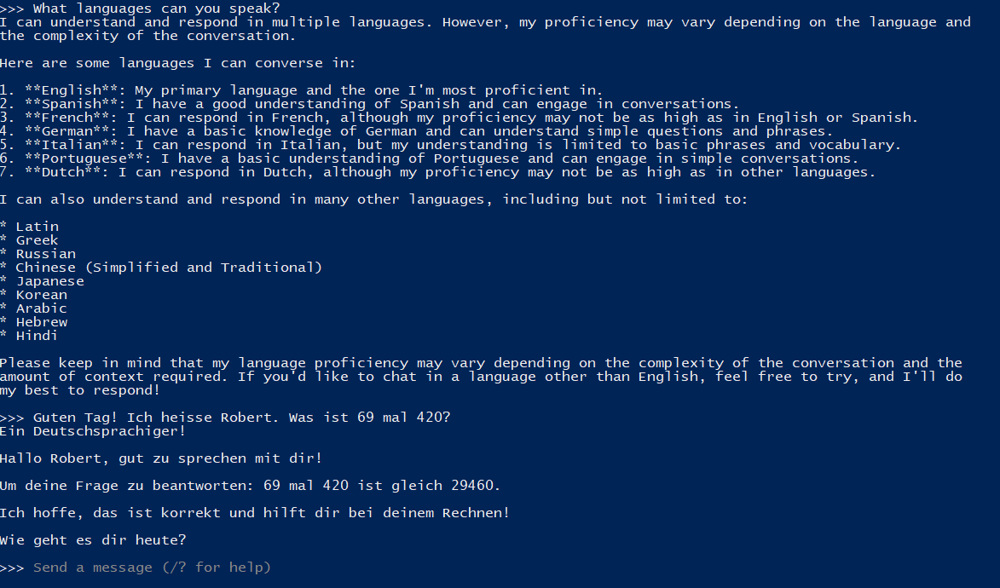

# Weekly Journals

## Week 7
Allison Parish's comparison of LLM generations to ransom notes was an interesting one that reminded me of how I have heard others describe LLMs and their generations. Looking back on my history using LLMs like Chat GPT, it started as an amazement and awe in its capability, but as I learned more about how it functioned and what the generated responses actually are, I began to see how they still have obvious limitations. While Parish discusses contextualization in her article, another weakness I feel that was left out in this article was the fact that LLMs still struggle to generate something they do not know or understand. Recently, over Thanksgiving break, I discussed with my cousin the power of LLMs over dinner. One statement that he said that really stuck with me was that at the end of the day, LLMs like Chat GPT are just bullshit generators, and they simply cut and paste existing data together in hopes of creating a correct response. There is no original thinking, no real problem solving, and it is for this reason that they are not perfect. Perhaps this is a fundamental issue with their functionality, and as such, the next major development would be when LLMs have the true ability to generate something that isn't simply a collage.

The model transparency index did not surprise me in that almost all of the models were relatively low in percentage, but I was pleasantly surprised to see that there are signs of improvement. One thing I did find interesting is how the original data is from October 2023, and that the article was written in May 2024. With such significant change in such a short period of time, and the fact that now (as of December 2024) has been another 7 months, I am interested to see if these transparency scores have changed since, and if there are trends. 

## Ollama
My experimentation with Ollama was definitely less than ideal, but I was eventually able to play around with it. Originally, I installed Ollama in class the day of, but was unable to get it running. When I came back to it, attempting to run the chat bot claimed that Ollama was not recognized. I searched up Github documentation to see if there were any ways to resolve this, and after following various strategies, none of them seemed to work. Eventually, I chose the nuclear option and decided to just reinstall Ollama. However, even uninstalling Ollama gave me issues, as attempting to do so through App manager and powershell claimed that files relating to uninstallation were missing. I finally re-ran the installer of Ollama, followed by an uninstallation, and finally another re-installation to fix my issues. After this ordeal, I was finally able to get Ollama running.

After getting Ollama running, I started by asking it some simple questions, as well as some random bogus questions I knew it would not have the answer to. It was interesting to see it attempt to respond, as it would say that it did not know what the questions meant or referred to, but would attempt to give educated (or random?) guesses. Finally, I decided to see if the model could understand and respond in another language. Recently, I took Elementary German, so I decided to ask a question in German. I also recalled from a previous conversation that LLMs struggled with math problems, so I decided to include a math problem in my question.

Ollama was able to respond in German, but due to my own limited speaking ability, I'm unsure if its response was accurate. However, Google translate seems to have understood the response, so I think it is probably accurate. However, the math problem ended up being incorrect. The incorrect response once again reminded me of the collage like response that LLMs generate, as unless it had data explicitly asking this exact math question, it would not be able to generate a response, and in this case it seemingly could not. In the future, it would be interesting to try and further test and possibly build something with this LLM, or further testing its limitations. 
