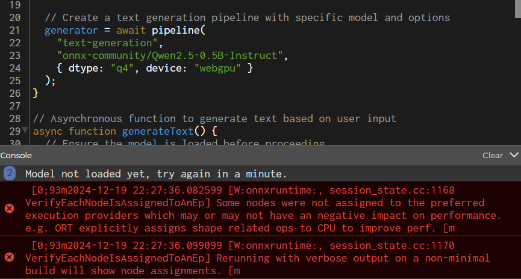

# Weekly Journals

## Week 8
As this is being submitted late (and not even an actual project, simply documentation), I'll spend most of this talking about my experience trying to get Transformers.js to work. Originally I found text generation and sentiment analysis to be the most interesting, and had hoped to work with those. I remember that when I was originally working on the assignment earlier in the semester, I tried to use the text generator as a base to try and create a chatbot of sorts, more specifically I was thinking of a verbal charades game. Basically, with an inputed word, the code would prompt the text generator to try and describe the input as much as possible without using the word itself, and that generated description could be shown to someone to get them to guess the original word. 

However, Transformers.js never worked properly for me. Despite using the same sketch that was used in class demos, the sketch never ran properly, and as such I was not sure where to start with actually modifying it to fit my purpose. I recalled that in class Prof. Dan had adjusted the WebGPU values to get it running, but inputing different parameters did not seem to help. The errors I got mostly seemed to be runtime errors, and before they showed up it would always state that the model was still loading. Due to my workload at the time, I decided to take a break from it and move on, hoping to get to it later.

I would once again touch Transformers.js when working on my final. This time, as I was looking for a way to ID and gauge drawings, I was considering using the sentiment analysis sketch that was also demonstrated in class and saved as a class example. However, the same issues occured, giving the same runtime errors that I was unable to resolve. Later, while working on the music generator part of my final project, I attempted to use MusicGen to create tracks as the user drew on the canvas. For once, the initial results actually seemed to work (although slowly), but before I could properly document it it once again began to fail. Later, Alan shared some examples that also utilized Transformers.js and MusicGen. Similarly to my own experimentation, however, it seemed to work once (albeit slowly), and simply timed out on every try after. 

Overall, working with Transformers.js was incredibly troublesome. I should have been more open about my troubles and asked for help sooner, but even towards the end when I did get some help from Alan, my issues persisted. Regardless, even thought I wasn't able to ever use it properly, the capabilities seem pretty cool and it would have been fun to play and experiment with. 
